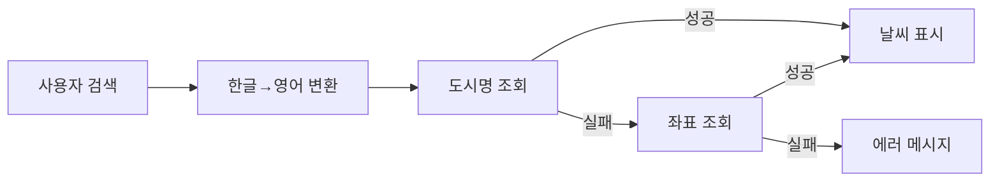

# GlassWeather

대한민국 전 지역의 날씨 정보를 조회하고 즐겨찾기로 관리할 수 있는 날씨 애플리케이션입니다.

## 🔗 배포 URL

- **Live Demo**: [https://glassweather-one.vercel.app/](https://glassweather-one.vercel.app/)
- **GitHub**: [https://github.com/SeoHee3478/glassweather](https://github.com/SeoHee3478/glassweather)

<!-- 📸 GIF 추가 위치 1: 메인 화면 전체 데모 -->


---

## 🚀 프로젝트 실행 방법

### 환경 변수 설정

프로젝트 루트에 `.env` 파일을 생성하고 다음 환경 변수를 설정합니다:

```env
VITE_WEATHER_API_KEY=your_openweathermap_api_key
```

> **🔑 API 키 발급 방법**
>
> **옵션 1) 테스트용 키 사용 (권장)**
> - 빠른 테스트를 위해 별도로 전달드린 API 키를 사용해주세요
> - 메일 본문 또는 첨부 문서를 확인해주세요
>
> **옵션 2) 직접 발급**
> 1. [OpenWeatherMap](https://openweathermap.org/api) 무료 회원가입
> 2. API Keys 메뉴에서 키 발급
> 3. 발급받은 키를 `.env` 파일에 입력
>
> **옵션 3) 배포된 데모 사용**
> - 로컬 실행 없이 바로 확인: [Live Demo](https://glassweather-one.vercel.app/)
>


### 설치 및 실행

```bash
# 의존성 설치
npm install

# 개발 서버 실행
npm run dev

# 프로덕션 빌드
npm run build

# 빌드 결과물 미리보기
npm run preview
```

---

## 📋 과제 요구사항 충족 현황

### 필수 기능

- [x] Open API를 통한 날씨 정보 조회 (현재 기온, 최저/최고 기온, 시간대별 기온)
- [x] 현재 위치 기반 자동 조회
- [x] 시/군/구/동 단위 장소 검색
- [x] 검색어 자동완성 리스트
- [x] 검색한 장소 즐겨찾기 CRUD (최대 6개)
- [x] 즐겨찾기 별칭 수정
- [x] 즐겨찾기 카드 클릭 시 상세 페이지 이동

### 필수 기술 스택 및 요구사항

- [x] React + TypeScript (Functional Component)
- [x] FSD(Feature-Sliced Design) 아키텍처
- [x] TanStack Query (서버 상태 관리)
- [x] OpenWeatherMap API 사용
- [x] korea_districts.json 활용하여 장소검색 구현
- [x] Tailwind CSS
- [x] 반응형 디자인 (Desktop/Mobile)

### 추가 구현 기능

- [x] 초성 검색 (빠른 지역 검색)
- [x] 검색 결과 무한 스크롤
- [x] 검색어 디바운싱 (성능 최적화)
- [x] 검색 정확도 기반 정렬
- [x] 즐겨찾기 추가, 삭제, 별칭 수정 시 Toast 알림

---

## 📁 프로젝트 구조 (FSD 아키텍처)

과제 요구사항에 따라 FSD(Feature-Sliced Design) 아키텍처를 적용했습니다.

```
src/
├── app/                    # 앱 설정 및 프로바이더
│   ├── App.tsx
│   └── providers/
│       ├── QueryProvider.tsx   # React Query 설정
│       └── RouterProvider.tsx  # 라우터 설정
│
├── pages/                  # 라우트별 페이지
│   ├── main/              # 메인 페이지 (날씨 조회 + 즐겨찾기)
│   └── detail/            # 상세 페이지 (시간대별 예보)
│
├── widgets/                # 페이지를 구성하는 독립적인 블록
│   ├── weather-dashboard/  # 날씨 대시보드 (검색 + 카드 + 즐겨찾기 목록)
│   └── weather-detail/     # 날씨 상세 정보
│
├── features/               # 사용자 시나리오 기능
│   ├── favorites/          # 즐겨찾기 CRUD
│   │   ├── model/         # Zustand store
│   │   └── ui/            # 버튼, 카드, 리스트
│   └── location-search/    # 장소 검색
│
├── entities/               # 비즈니스 엔티티
│   ├── weather/            # 날씨 정보 조회
│   │   ├── api/           # API 호출 함수
│   │   ├── model/         # React Query 훅, 타입
│   │   └── ui/            # WeatherCard
│   └── location/           # 지역 이름 조회
│       ├── api/           # API 호출 함수
│       └── model/         # React Query 훅, 타입
│
└── shared/                 # 공용 유틸리티
    ├── data/              # 정적 데이터 (행정구역 JSON, 좌표)
    ├── hooks/             # 커스텀 훅 (useGeolocation)
    └── lib/               # 유틸 함수 (검색, 한글 처리)
```

**구조 설계 의도:**

- `entities/weather`에 API, 타입, 쿼리 훅을 모아 날씨 도메인 응집도 향상
- `features`에서 즐겨찾기와 검색을 분리하여 독립적 개발/테스트 가능
- `shared/lib`에 한글 처리와 검색 로직을 별도 유틸로 분리

---

## ⚙️ 구현 기능

### 1. 날씨 조회

현재 날씨와 시간대별 예보를 조회합니다.

- **현재 위치 기반**: 브라우저 Geolocation API로 사용자 위치 감지, 위치 권한 거부 시 서울 기본값 사용
- **장소 검색 기반**: 검색한 지역의 날씨 조회
- **즐겨찾기 기반**: 저장된 장소들의 실시간 날씨 표시

<!-- 📸 GIF 추가 위치 2: 현재 위치 기반 날씨 조회 -->


### 2. 장소 검색

대한민국 전체 행정구역(20,000+ 지역)을 검색할 수 있습니다.

<!-- 📸 GIF 추가 위치 3: 장소 검색 및 자동완성 -->


**검색 최적화:**

- **무한 스크롤**: 초기 10개만 표시, 스크롤 시 10개씩 추가 로드하여 대량 검색 결과를 효율적으로 렌더링
- **디바운싱**: 매 키 입력마다 약 2만개 항목을 필터링하던 것을 300ms 디바운싱으로 최적화
- **정확도 기반 정렬**: 원본 정확 일치, 정규화 일치, 시작 일치 등 가중치 기반 정렬

**검색 편의 기능:**

- **초성 검색** : 빠른 입력을 위한 초성 검색 지원 (예: `ㅅㅇ` → 서울, 수원)
- **정규화 검색**: `서울`, `서울시`, `서울특별시` 모두 동일하게 검색 (행정구역 접미사 자동 처리)

### 3. 즐겨찾기 관리

자주 확인하는 장소를 즐겨찾기로 저장하고 관리합니다.

<!-- 📸 GIF 추가 위치 4: 즐겨찾기 추가/삭제/수정 -->


| 기능      | 설명                                         |
| --------- | -------------------------------------------- |
| 추가/삭제 | 최대 6개까지 저장, 토글 방식                 |
| 별칭 수정 | 인라인 편집으로 사용자 지정 이름 설정        |
| 날씨 표시 | 각 카드에서 해당 지역 실시간 날씨 조회       |
| 상세 이동 | 카드 클릭 시 상세 페이지로 이동              |
| 영구 저장 | localStorage에 저장되어 새로고침 후에도 유지 |
| 토스트 알림 | 추가/삭제/수정 시 즉각적인 피드백으로 사용자 편의성 향상 |

---

## 👩‍💻 기술적 의사결정

### 1. 검색 최적화: 디바운싱 + 무한 스크롤 + 가중치 정렬

**배경:** 20,000개 행정구역 데이터를 효율적으로 검색하기 위한 전략

| 기법                    | 선택 이유                 | 효과                 |
| ----------------------- | ------------------------- | -------------------- |
| Lodash debounce (300ms) | 검증된 라이브러리, 안정적 | 불필요한 필터링 방지 |
| 무한 스크롤 (10개씩)    | 초기 렌더링 부담 최소화   | 첫 렌더링 시간 개선|
| 가중치 기반 정렬        | 정확한 결과 우선 표시     | 사용자 경험 개선     |

**검색 정확도 가중치 알고리즘:**

```typescript
// 1순위: 원본 정확 일치 (가중치 100)
if (district.full === searchTerm) return 100;

// 2순위: 정규화 후 일치 (가중치 90)
if (normalizedDistrict === normalizedSearch) return 90;

// 3순위: 시작 일치 (가중치 80)
if (district.full.startsWith(searchTerm)) return 80;

// 4순위: 초성 일치 (가중치 60)
if (getChosung(district.full) === searchTerm) return 60;
```

### 2. 즐겨찾기 상태 관리: Zustand + persist

**선택:** Zustand + persist middleware

**이유:**

- **전역 상태 동기화**: 메인 페이지 ↔ 상세 페이지 즐겨찾기 상태 자동 동기화
  - localStorage 직접 사용 시 `window.addEventListener('storage')` 등으로 수동 동기화 필요
  - Zustand는 상태 변경 시 구독 중인 모든 컴포넌트에 자동으로 반영
- **영구 저장 자동화**: persist 미들웨어로 localStorage 읽기/쓰기 자동 처리
- **간결한 API**: Context + useReducer 대비 보일러플레이트 최소화
- **경량**: Redux Toolkit(~40KB) 대비 Zustand(~3KB)

```typescript
// localStorage 직접 사용 시 문제점
const addFavorite = (location) => {
  const current = JSON.parse(localStorage.getItem("favorites") || "[]");
  localStorage.setItem("favorites", JSON.stringify([...current, location]));
  // 다른 컴포넌트에 변경 알림 필요
  // 페이지 전환 시 수동 새로고침 필요
};

// Zustand 사용 시
const addFavorite = useFavoritesStore((state) => state.addFavorite);
addFavorite(location); // 자동으로 모든 컴포넌트에 반영
```

### 3. React Query 캐싱 전략

날씨 데이터의 특성(10분 단위 업데이트)을 고려한 캐싱 설정:

```typescript
const CACHE_CONFIG = {
  staleTime: 10 * 60 * 1000, // 10분간 fresh 상태 유지
  gcTime: 30 * 60 * 1000, // 30분간 캐시 보관
};
```

**효과:**

- 동일 지역 재조회 시 API 호출 없이 즉시 응답
- 불필요한 네트워크 요청 감소

---

## 🌠 트러블슈팅

### 1. OpenWeatherMap API 도시명 검색 실패

**문제:**

- OpenWeatherMap API가 일부 지역(특히 동 단위)을 도시명으로 검색하지 못함
- 한글 지역명 검색 정확도가 낮음

**해결: 이중 검색 전략 (Fallback)**

```
1차: 한글 지역명 → 영어 도시명 변환 → API 호출
     ↓ 실패 시
2차: 미리 구축한 좌표 데이터(위도/경도)로 재검색
     ↓ 모두 실패 시
에러 메시지: "해당 장소의 정보가 제공되지 않습니다"
```



**데이터 구축:**

- 전국 시/군의 영어명 매핑 테이블
- 전국 시/군의 좌표 데이터

---

## ⚒️ 기술 스택

### Core

| 기술       | 버전   |
| ---------- | ------ | 
| React      | 19.2.0 | 
| TypeScript | 5.9.3  |
| Vite       | 7.2.4  |

### 상태 관리 & 데이터 페칭

| 기술                 | 버전    |
| -------------------- | ------- | 
| TanStack React Query | 5.90.16 | 
| Zustand              | 5.0.10  | 

### UI & 스타일링

| 기술         | 버전   | 
| ------------ | ------ | 
| Tailwind CSS | 3.4.19 |
| Heroicons    | 2.2.0  |
| Sonner       | 2.0.7  |

### 유틸리티

| 기술             | 버전    | 
| ---------------- | ------- | 
| Lodash           | 4.17.21 | 
